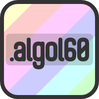
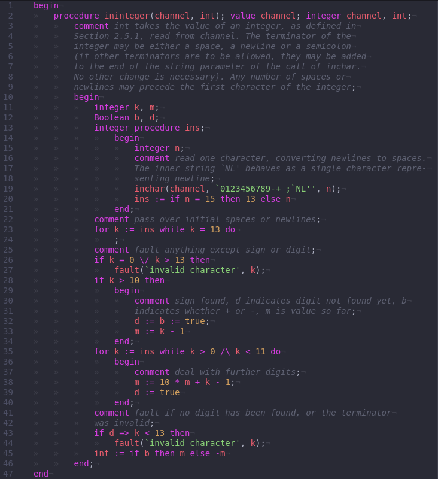

# *Algol 60* syntax highlighter 

*Algol 60* language support (grammar and snippets) in *Atom*, [*Pulsar*](https://web.pulsar-edit.dev/packages/language-algol60) and [*Visual Studio Code*](https://marketplace.visualstudio.com/items?itemName=TrisTOON.language-algol60)

